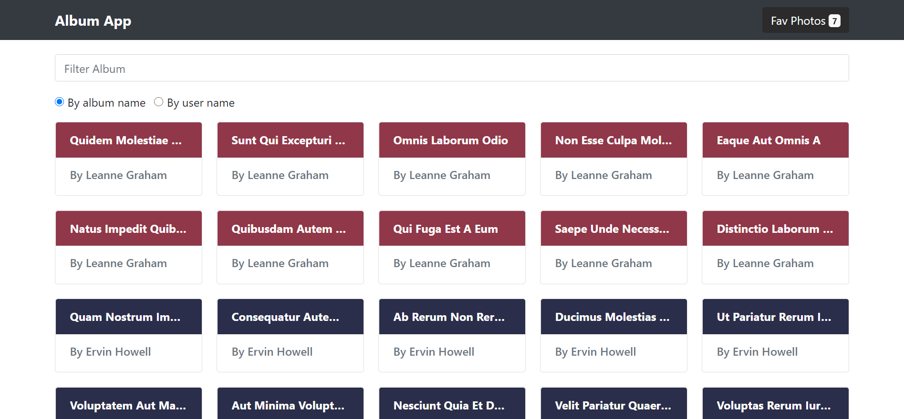
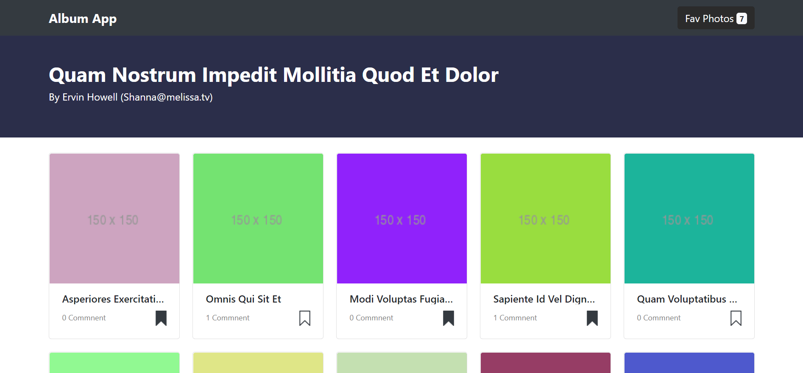
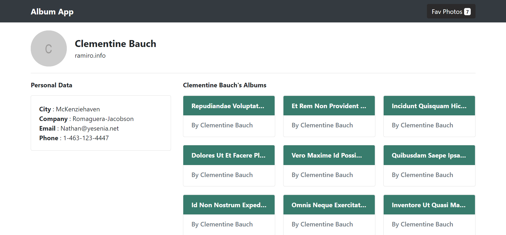
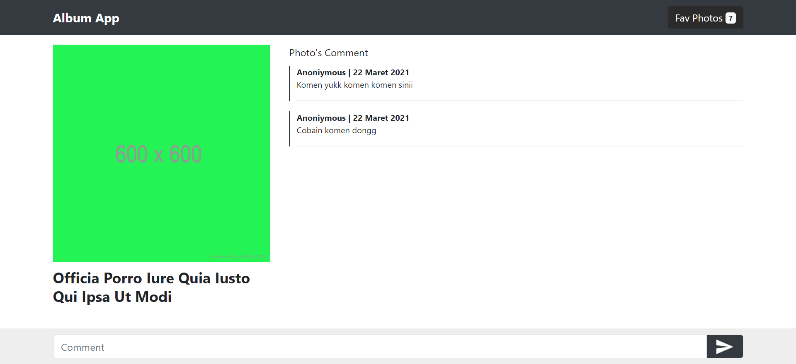
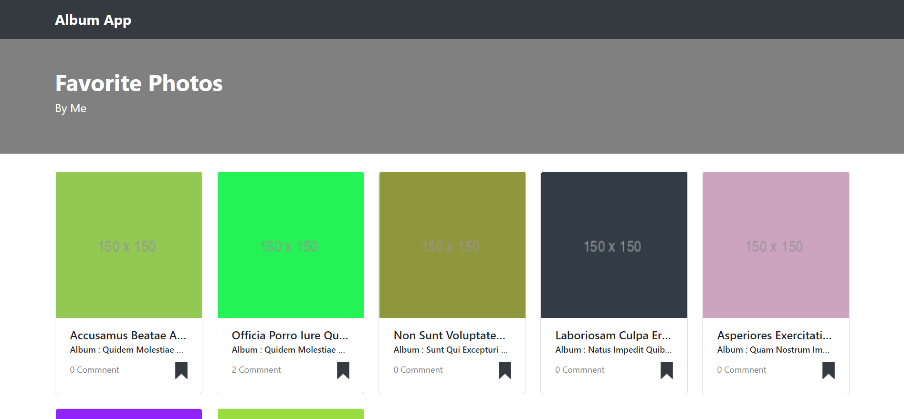

# Album App
Show album photos and user from [jsonplaceholder](https://jsonplaceholder.typicode.com/), you can add comment and saved your favorite photos

## Preview






## Build Setup

``` bash
# install Node Module dependencies
npm install

# runs the app in the development mode.
npm start

# build for production with minification
npm run build
```

## Technologies
This project uses several technologies listed below :

- **[React Typescript](https://www.typescriptlang.org/docs/handbook/react.html)**
- **[React Router](https://reactrouter.com/)**
- **[React Context](https://reactjs.org/docs/context.html)**
- **[React Bootstrap](https://react-bootstrap.github.io/)**
- **[Sass](https://sass-lang.com/)**
- **[Axios](https://github.com/axios/axios)**

